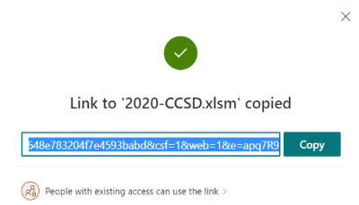
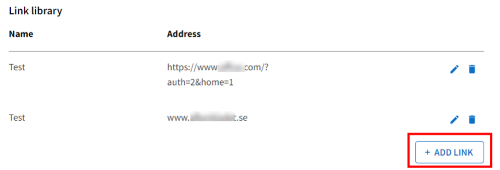
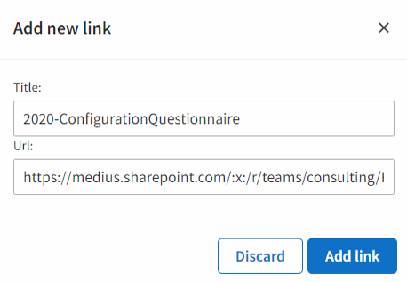

Link to documents on project Sharepoint site from Customer Space tab.

For each document, do the following:

1. Copy link in SharePoint with permission "People with existing access can use the link".

2. In Link Library, click Add Link.

3. Paste link to document and copy/paste document name from SharePoint.

