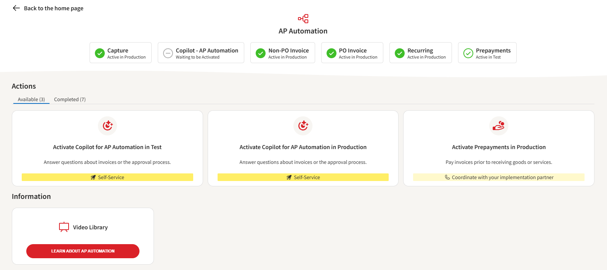

## Application pages

### Activation Status

Application pages display activation status by add-on or sub-module (if applicable). The statuses include:

- **Waiting to be activated**
- **Active in Test**
- **Active in Production**

Additionally:

- **Not subscribed** (add-on is not included in the subscription)
- **Managed by implementation partner** (activation from the Onboarding Portal is currently not supported)

### Actions

Activation tasks are displayed as tiles. A task can be:

- **Pending** on another task to be completed first
- **Available** for start, with a recommendation on how to proceed, either via self-service or assisted by the implementation partner
- **Completed**

When starting an activation task, a new pop-up window will guide you through the activation process, either step-by-step or in a single step, with instructions for completing the task.

There are two categories of tasks:

1. **Self-Service Module Activation**: You can activate all modules yourself, but it is recommended to proceed on your own only for those labeled 'Self-Service'.
2. **Partner-Assisted Activation**: Coordinate with your implementation partner. Their expertise will ensure these modules are set up optimally, allowing you to fully leverage their capabilities.

Emails will be sent to contacts defined via Onboarding Portal settings once a task is completed. The status will also be reflected on the task tile and on the home page.

### Additional Information

For some applications, you can also access additional information, such as product introduction videos.

