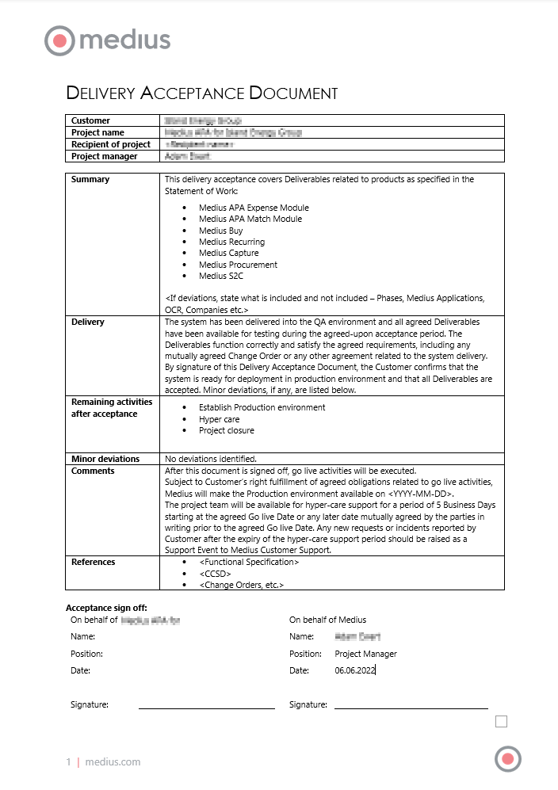

Once the Medius QA is fully tested and approved then you will be sent a document from the Medius Project Manager entitled the "Delivery Acceptance Document". This document will be used for formal acceptance, and can also highlight any outstanding actions that will be carried into Hypercare for resolution by the project team before project closure. This could, for example, include additional modules or companies not included within the first go-live wave.

