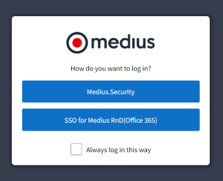

## Accessing the Onboarding Portal After Test Tenant Creation

### Authentication and Access

- **Authentication Required**:  
  To deploy products, you must be authenticated. Without logging in, you can still view product status and complete "Getting Started" tasks.

- **Logging In**:  
  Use the login button on the landing page to activate products. Once logged in, product activations are enabled.

### Shared Authentication

- **Unified Login System**:  
  The Onboarding Portal (OP) uses the same authentication system as the Medius suite. Logging into the Medius suite will also log you into the OP.

### Admin Role Requirement

- **Admin Access Only**:  
  Only users with an Admin role can log in to the OP.

### Default Admin Account

- **Account Creation**:  
  A default admin account is automatically created with the QA tenant. Credentials for this account are sent to the primary contact specified in the OP settings.

- **Access Provided**:  
  This default admin account grants access to the entire suite, including the OP.
  

