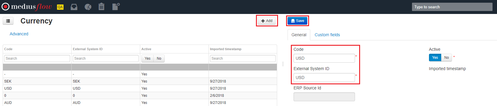
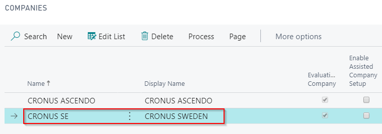

The very first step to get going with Medius is to add your organization(s) to the Medius company structure. The companies added to Medius should typically reflect your organization's legal entities and company codes in your ERP.

## Set the Company structure
It's important to setup a good company structure that reflects not only your legal entities but also reflects how the legal entities are organized.
Best practice guidelines for establishing the company structure is found on the Medius Success Portal here: [Company structure design guidelines](https://success.mediusflow.com/documentation/administration_guide/administration_pages/configuration_tutorials/company_structure/)

If you have many legal entities or a complex organization structure it is recommended to consult your implementation partner to build the organizational structure in Medius.

Company codes are added in Medius using this administration page: [Add companies here](https://cloud.mediusflow.com/$TenantNameQA/#/Administration/Medius.Core.Entities.Company)
When adding companies you have to fill in the accounting currency of each company. A new Medius deployment is preconfigured with the most common currency codes but if the currency code you need is missing from the list you can add it by following the below instruction.

The company configuration holds a lot of details and provides many possibilities. In this step we'll only add the basics. Detailed company configuration will be covered in other sections.
Guidance to all company configuration options in Medius can be found in this Success Portal section: [Success portal company configuration](https://success.mediusflow.com/documentation/administration_guide/administration_pages/company/)

### If currency code is missing
If any accounting currency code used by your legal entities is missing you need to add it manually before creating the companies. This is done by following below steps.
[Add currency codes here](https://cloud.mediusflow.com/$TenantNameQA/#/Administration/Medius.Core.Entities.Currency)

1. Click **Add**
2. Enter currency ISO code (or currency code as found in ERP) in both *Currency* and *External System ID* fields
3. Click **Save**

### Create the virtual top node company
Administration -> Company
Add a virtual company with company id V_D365BC below root. V_D365BC is the preferred company to do any changes that are common for all D365 Business Central (BC) companies. All the BC companies that are created should have V_D365BC as parent to follow best practice. 

Property | Value | Comment
--- | --- | ---
**Name** | D365 BC Root | 
**Organization Number** | - | Not needed for virtual
**Is Virtual** | Yes | Must be virtual
**Accounting Currency** |  | Choose the currency code that applies to the majority of companies within this company group
**External System ID** | company[V_D365BC] | Cannot be changed when saved
**ERP Id** | D365BC | 

### Create the rest of the companies
Add the rest of the companies that are provided from the customer. If many companies are to be added you may consider to have another virtual level, i.e. country based for different settings in different countries. Note that it's not recommended to add these levels after the leaf companies have been created so please take some time to evaluate the possibility of companies added in the future to establish a good initial company structure.

Property | Value | Comment
--- | --- | ---
**Name** | Company name in Medius | Can be different from the name in BC.
**Organization Number** | - | Not mandatory, but nice to have
**Is Virtual** | No | No for all leaf companies
**Accounting Currency** |  | Cannot be changed after saving.
**External System ID** | company[CRONUS SE] | Must match the name of the company in BC.

The above needs to be set once, and it needs to match what is sent in the integration.
Note that you need to use the real name of the BC company, not the "Display name" as that is only a visual name in BC and can't be used to call the company functions:

