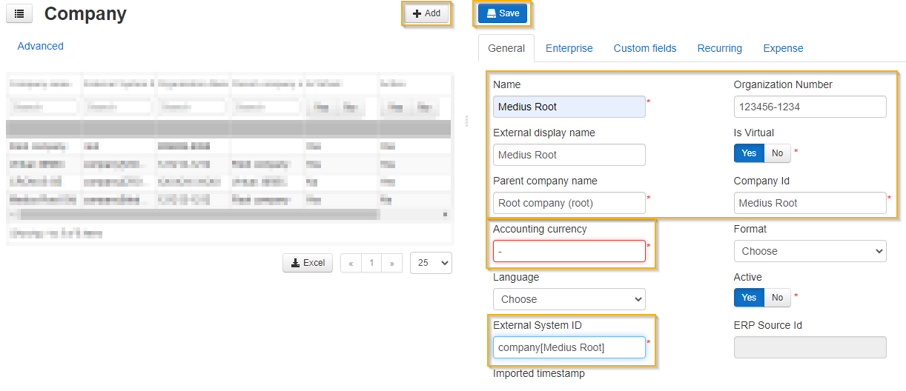
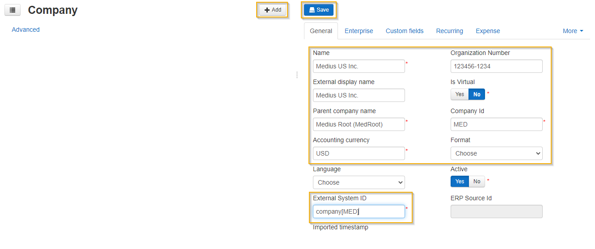

The very first step to get going with Medius AP Automation is to add your organization(s) to the Medius company structure. The companies added to Medius should typically reflect your organization's legal entities and company codes in your ERP.

## Set the Company structure
It's important to setup a good company structure that reflects not only your legal entities but also reflects how the legal entities are organized.
Best practice guidelines for establishing the company structure is found on the Medius success portal here: [Company structure design guidelines](https://success.mediusflow.com/documentation/administration_guide/administration_pages/configuration_tutorials/company_structure/)

If you have many legal entities or a complex organization structure it is recommended to consult your implementation partner to build the organizational structure in Medius.

Company codes are added in Medius using this administration page: [Add companies here](https://cloud.mediusflow.com/$TenantNameQA/#/Administration/Medius.Core.Entities.Company)
When adding companies you have to fill in the accounting currency of each company. A new Medius deployment is preconfigured with the most common currency codes but if the currency code you need is missing from the list you can add it by following the below instruction.

The company configuration holds a lot of details and provides many possibilities. In this step we'll only add the basics. Detailed company configuration will be covered in other sections.
Guidance to all company configuration options in Medius can be found in this success portal section: [Success portal company configuration](https://success.mediusflow.com/documentation/administration_guide/administration_pages/company/)

### If currency code is missing
If any accounting currency code used by your legal entities is missing you need to add it manually before creating the companies. This is done by following below steps.
[Add currency codes here](https://cloud.mediusflow.com/$TenantNameQA/#/Administration/Medius.Core.Entities.Currency)

1. Click **Add**.
2. Enter currency ISO code (or currency code as found in ERP) in both *Currency* and *External System ID* fields.
3. Click **Save**.

### Add a virtual company node
The virtual company structure can be used to setup a scalable company model where master data and configuration is shared depending on needs. Below is the minimum level of virtual structure required in a SAP context. 
This should be extended in accordance with your company structure design.

Add a virtual company with company id V0 beneath root. All real company codes should have V0 as parent. 
This allows for an efficient configuration approach where settings can be done at V0 level and thereby apply to all companies.

1. Click **Add**.
2. In the field *Name*, fill in the name of the virtual node. Proposed naming convention is the name of your organization followed by "Root", e.g. "Medius Root".
3. Enter any value into the field *Organization Number* - this field is technically required but is not utilized.
4. Choose **Root company** in the field *Parent company name*.
5. Switch the value of *Is Virtual* to **Yes**.
6. Choose the currency code that applies to the majority of companies within this company group as *Accounting currency*.
7. In the field *Company Id*, enter V0.
8. Add *External System Id* according to the following format: "company[V0]".
9. Navigate to the tab **Enterprise** and further to the tab **General**  and set the field *ERP Id* to "SAP"
10. Click **Save**.

### Add your companies
Now add the company codes of your organization by repeating the below steps for each company code.

1. Click **Add**.
2. In the field *Name*, fill in the name of the company.
3. Enter any value into the field *Organization Number* - this field is technically required but is not utilized.
4. Choose your recently added virtual company node **Root company** in the field *Parent company name*.
5. Check that the value of *Is Virtual* is **No**.
6. Choose the accounting currency for this specific company in field *Accounting currency*.
7. In the field *Company Id*, enter the company id that represents this specific company in your ERP, i.e. 001, MED, US02.
8. Add *External System Id* according to the following format: "company[Company Id]" where Company Id inside of brackets is the same value as recently entered in field *Company Id*.
9. Click **Save**.

