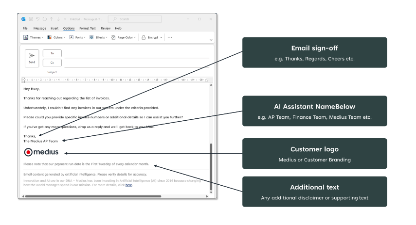

> It is recommended that you carry out this task with the assistance of your implementation partner.

## Shared Mailbox Email Address 

You typically use a shared mailbox for supplier queries, such as finance@yourcompany.com or accountspayable@yourcompany.com.

## Preview Mailbox Email Address (Optional) 

Supplier Conversations allows you to choose whether autogenerated emails go directly to your suppliers or to you first. 
* If emails go directly to your suppliers, no action is needed. 
* If you prefer to receive them first, you will need a separate email address. This is because if you have set up an auto email forwarding rule (described below), replies sent to the suppliers will not be received in the preview mailbox if it uses the same email address as the shared mailbox where the auto forwarding rule is set.

Note: This setting can be changed later. You can start in preview mode, and once you're confident, emails could be sent directly to suppliers.

## Escalation Mailbox Email Address

You generally use a shared mailbox for escalated queries. 

This email address is required so that Supplier Conversations can escalate any queries needing manual intervention. In most cases, this will be the same address provided for the Shared Mailbox Email Address, though some of you may opt to use a different one.

## Enable Auto Forwarding (Optional)

Instead of manually communicating this new email address to all your suppliers, we recommend setting up an auto-forwarding rule to ensure emails are forwarded to the bot for processing and response. The steps to follow can be found here: *Email redirection settings*

## Email Branding Preferences

To ensure the email aligns with your branding, Supplier Conversations allows customizations. 
* **Email Sign-off**: The friendly text used to close the email, such as "Thanks," "Regards," or "Cheers."
* **AI Assistant Name**: The name displayed at the bottom of the email and in the sender field, such as "AP Team," "Finance Team," or "Invoice Enquiries Team."
* **Additional Text**: Any extra text to include in the email footer, which will appear above the disclaimer.
* **Logo**: The logo you want to use in the email footer.

