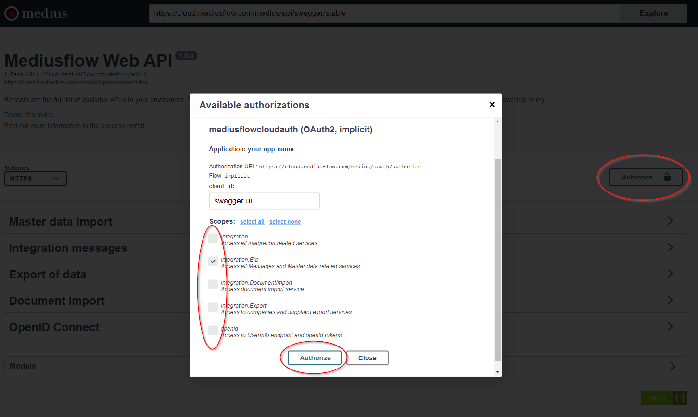

## Client set-up

First thing is to set up a Client in Medius AP Automation to be able to authenticate towards Medius AP Automation.

Please see guide on creating a client, [Client set-up](https://success.mediusflow.com/documentation/integration-documentation/getting_started/rest/#application-setup)

You can access Client settings in Medius AP Automation, [Client application](https://cloud.mediusflow.com/$TenantNameQA/#/Administration/Medius.Core.Entities.Api.ClientApplication)

## Authentication

Since you now have a Client created in Medius AP Automation its time to test the authentication. 

Follow guidance [Authorizing with the API](https://success.mediusflow.com/documentation/integration-documentation/technical/rest/authorization/)

If you want to work with the [Swagger test portal](https://cloud.mediusflow.com/$TenantNameQA/api/documentation/), authentication is done through the portal. If the test portal client is activated, just hit Authorize and authenticate with your user that is connected to the client.

