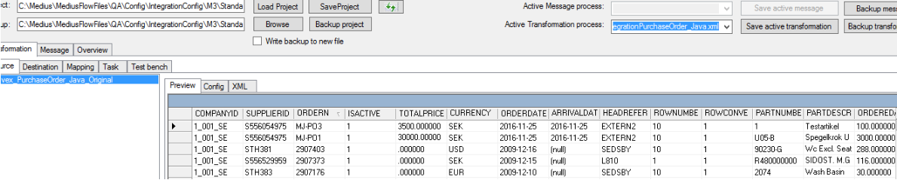

When the M3 integration interface is installed in the M3 test environment and the corresponding MIG M3 integration package is installed on the integration server the next step is to test the connection and preview some masterdata.

To do this the Medius consultant will start the MediusIntegrationGateway tool on the Integration server and open the deployed MIG process file folder containing the MIG M3 process files. 

