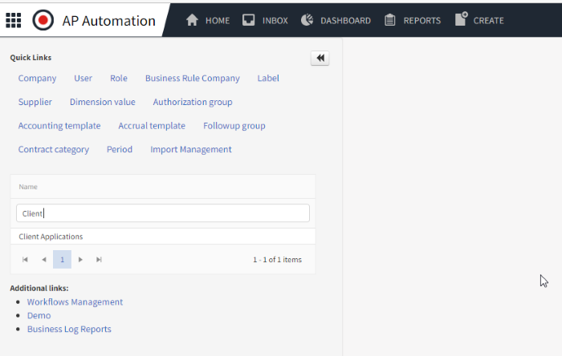
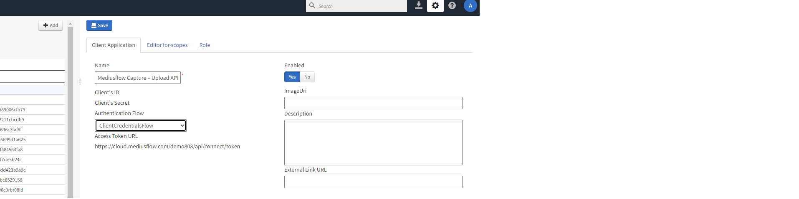
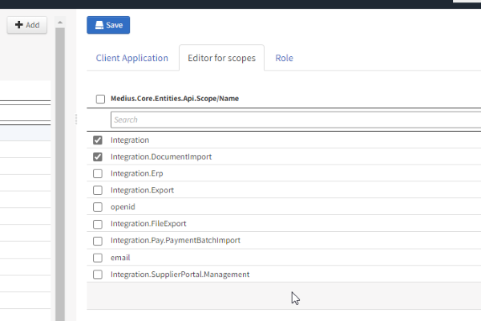
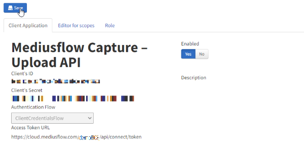

Go to Client Applications under Adminstration.

1. Click Add
2. Set Name to: **Mediusflow Capture – Upload API**
3. Set Authentication flow **ClientCredentialsFlow** 

1. Change tab to Editor for scopes
2. Tick boxes for **Integration** and **Integration.DocumentImport**
3. Press Save

From the newly created Client application write down:

1. Client’s ID
2. Client’s Secret

The client needs this information for authentication purposes.  
