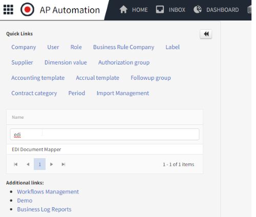
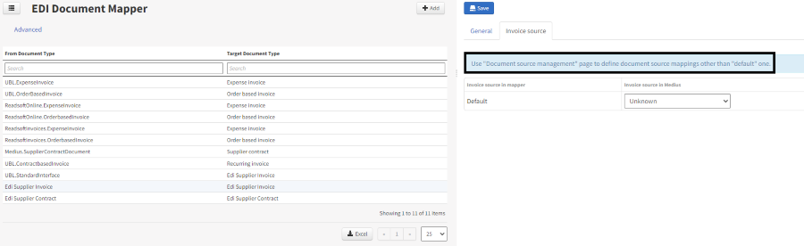
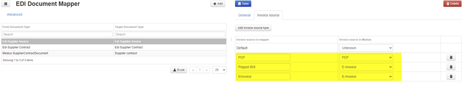

To be able to filter out e-Invoices in reports, invoice sources and formats must be added. This is done under EDI Document Mapper and Document Source Management.

The first configuration is located under EDI Document Mapper.

Click on Edi Supplier Invoice. If you see the below message no further configuration of the invoice sources is necessary and you are good to go. Otherwise continue with the steps below.

Add three source types in the left column:

1. EInvoice
2. Peppol BIS
3. PDF

... and press Save.

