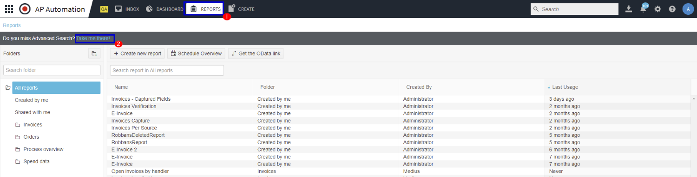
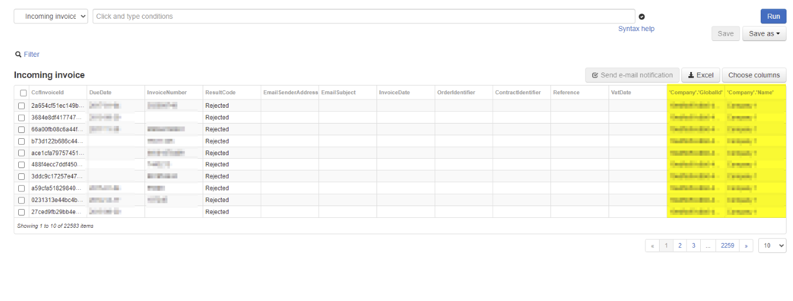
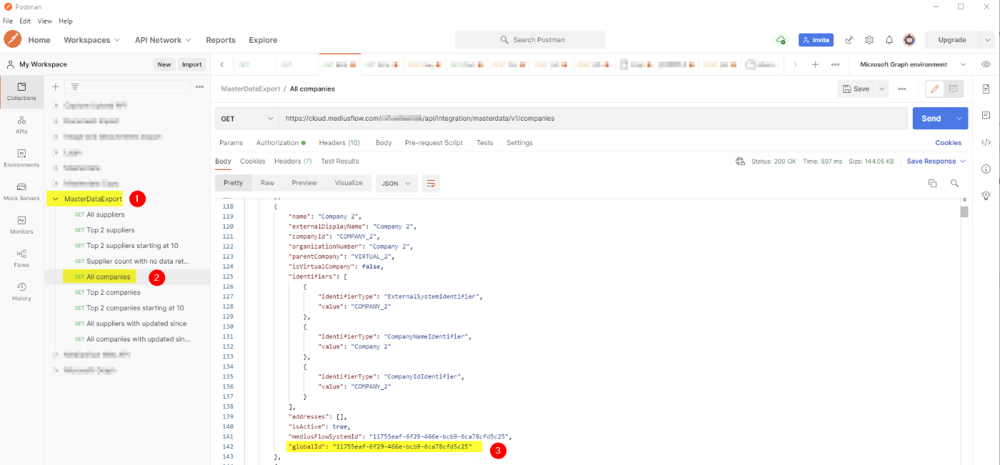

When sending invoices through the Capture Upload AP it is mandatory to identify every receiving company on the APA side by using the globalId. This is an internal and non-editable ID, which makes it a safe way to identify the receiving company. In this section you will find information regarding how to extract this Id from the customer's APA tenant. This can be done by using the UI or Postman.

**Extract globalId using APA UI**

* Send a PDF-invoice (through Email) to each Company that you want to retrieve the globalId for. 
* Log in to APA and go to Advanced Search.
    1. Reports
    2. Advanced Search 

* Choose Incoming invoice and run it.

* Click on Choose columns and Add column.
* Under Company, add GlobalId and Name, and then press Apply.
* In the invoice list, the Company name and GlobalId will be visible next to each other.

* Either the values can be copied directly from the UI or simply downloaded to Excel, where it’s easy to filter out the information.
 
**Extract globalId using Postman**

You can also use Postman and the credentials (Client’s ID & Client’s Secret) from the previously created client application. 

Use the credentials to create a token for authentication and then:  

1. Use the [MasterDataExport collection](https://www.getpostman.com/collections/b7cdee77eb475e150741) 
2. GET ALL Companies
3. Find the GlobalId for the client company

