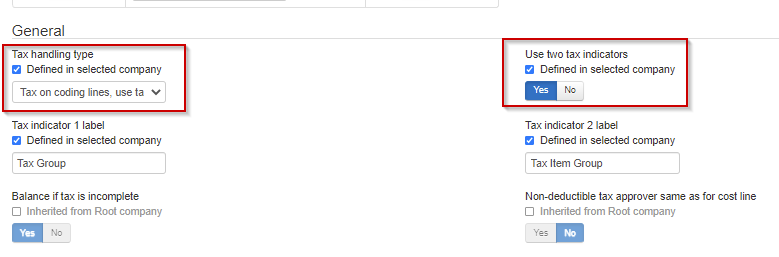

### Activate two tax indicators

To use Two Tax Indicator, make sure it is activated under Administration -> Company -> Enterprise -> Tax. Both the "Use two Tax Indicators" and the "Tax on coding lines" needs to be checked for the AX2012 integration.

### TaxItemGroup

After master data is imported, set default tax item group in TaxIndicator2 if solution is using Tax.
