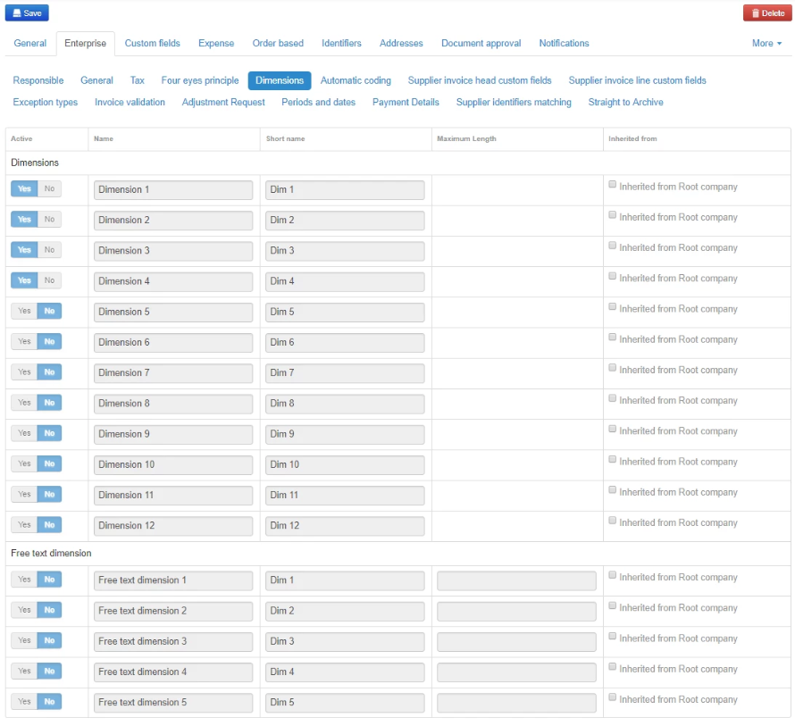

Medius needs to be configured with the dimensions and dimension names that are relevant for your organization. 
Dimensions are configured in the [Company configuration](https://cloud.mediusflow.com/$TenantNameQA/#/Administration/Medius.Core.Entities.Company/). Then browse to the **Enterprise** tab and choose **Dimensions**.

The coding dimensions in Medius should reflect the G/L and account assignment structure that you are using in NAV. In Medius, the order of account assignments is determined by the number of the dimensions used. The integration setup card in NAV is used to map the order of dimension types.

Dimensions can be configured at virtual company level and/or in the real company codes. 

Please consider that names of the dimensions are not impacted by user language settings. So, if you'd like to use different dimension names for different companies Dimension configuration should not be done at virtual level. However, it's possible to inherit the dimension settings for a set of the child companies if only one or a few has exceptions.

In addition to the G/L dimensions it is common to enable a free text dimension for the purpose of approvers to enter an descriptive text to the G/L entry that will also be posted to the G/L entry in NAV. See point 5 in the list below. For more details, please ask your Medius consultant.

In a newly created tenant the dimension configuration looks like this:

1. Click the **Inherited from Root company** checkbox, changing it to **Defined in selected company** for all rows in the table. It's also possible to make exceptions per line for the current company.
2. Set the toggles in the **Active** column for the Dimensions you want to use to **Yes**.
3. Enter the appropriate dimension name for the dimensions that should be used in the *Name* column. This name will be displayed in the tooltips. These tooltips appear when one of the coding fields is active. 
4. Enter a short version of the label in the **Short name** column. This name will be displayed in the coding field itself.
5. Enable *Free text dimension 1* with appropriate name to allow for G/L text entry. Set the maximum length to **50** since this is maximum number of characters acccepted by NAV. 
6. Click **Save**.

NAV has a limit of 50 characters for the field Description. When and if a free text dimension is needed add it as below.

Activate Free text dimension 1 as below.

