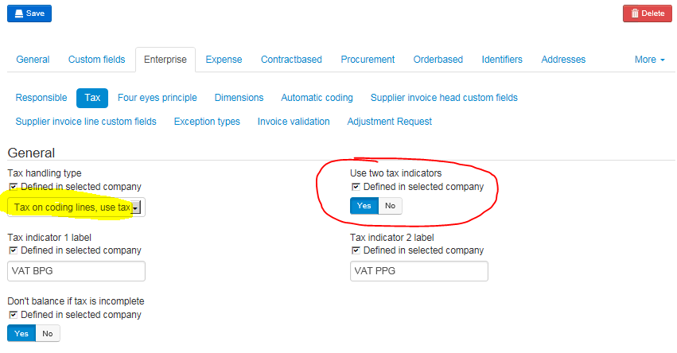
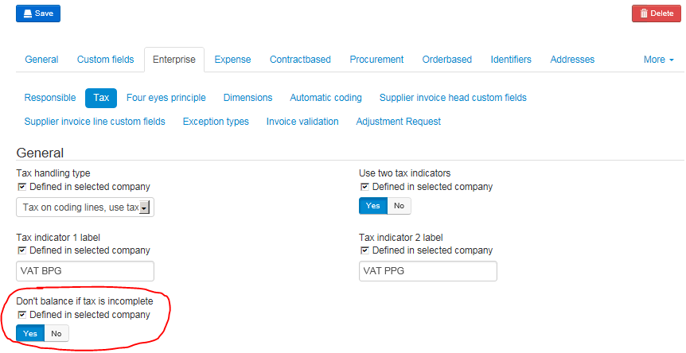

### Activate two tax indicators

To use Two Tax Indicator, make sure it is activated under Administration -> Company -> Enterprise -> Tax.
Both the "Use two Tax Indicators" and the "Tax on coding lines" needs to be checked for the NAV integration.

### Avoid extra VAT Line

Usually Medius always creates an "unwanted" balancing coding line if the "Tax Indicator 2" field is missing on coding line (which is the most common case because no Dimension 1 value has not yet been filled in in the Distribution step).

To avoid this extra line, make sure that "Don't balance if tax is incomplete" is checked:

