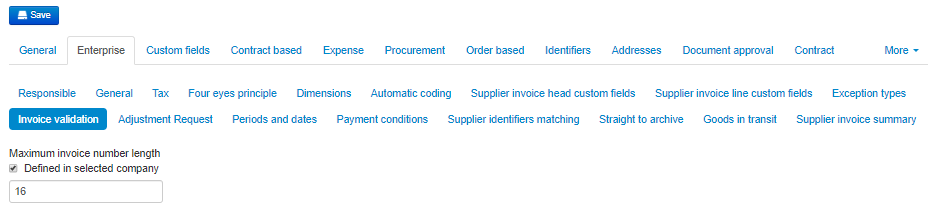
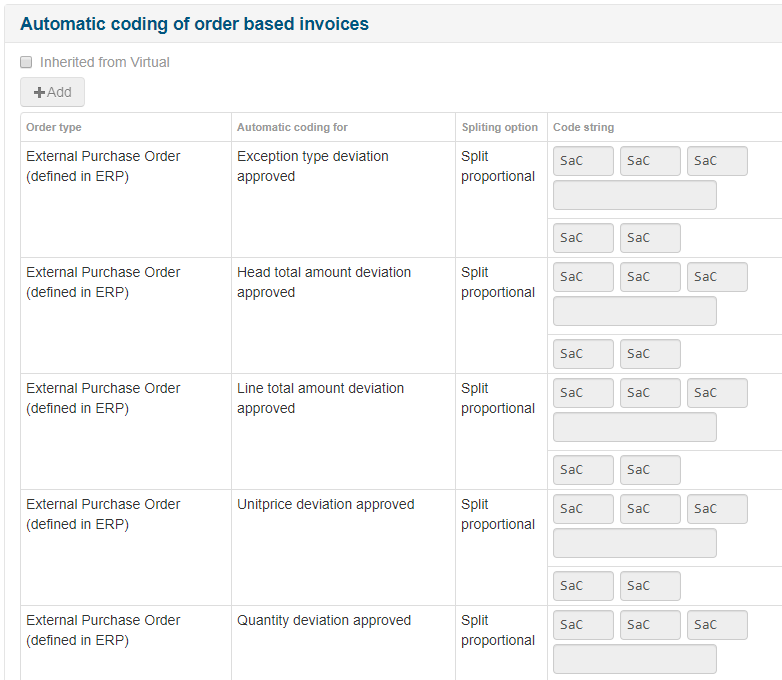
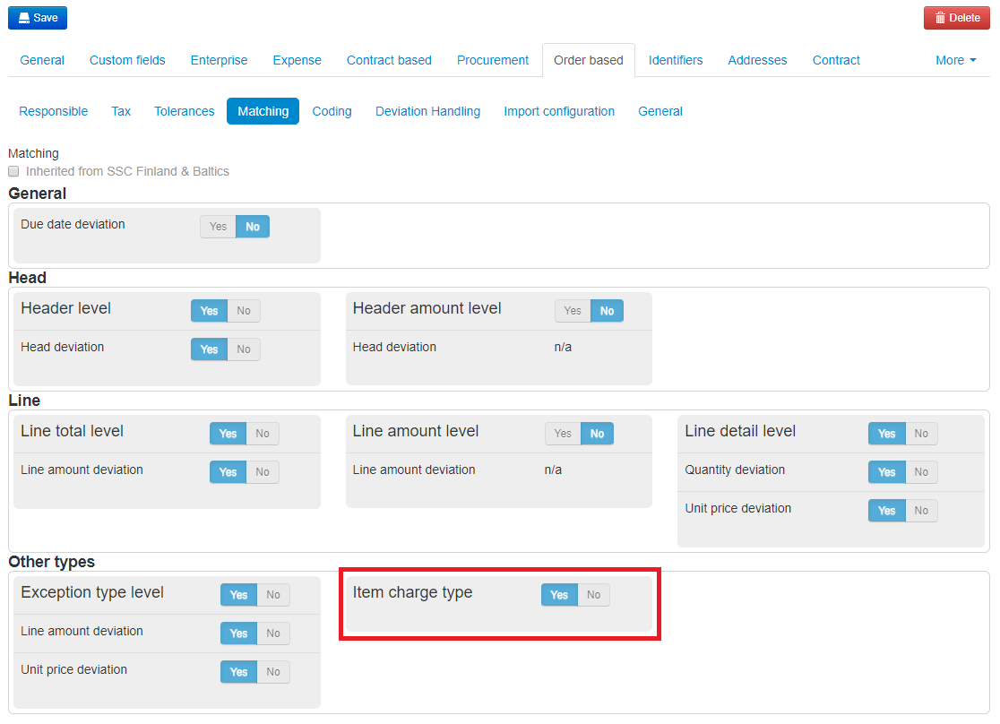
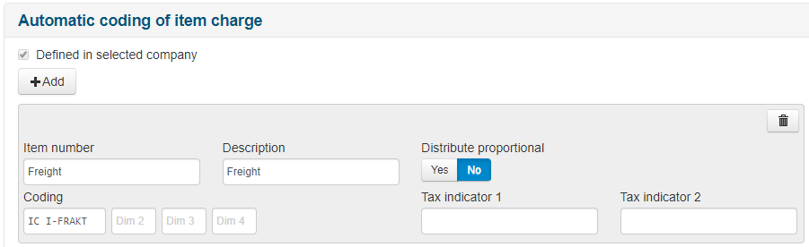
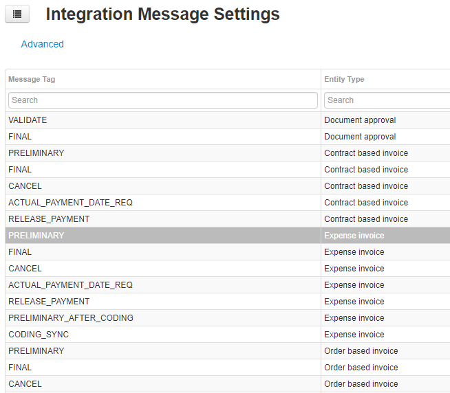
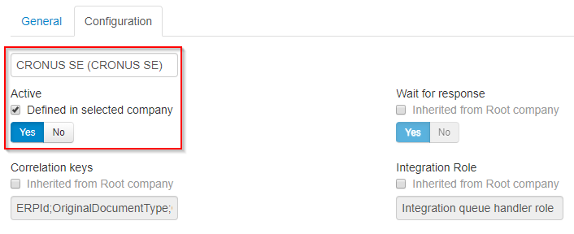

## Tax
### Activate two tax indicators

To use Two Tax Indicator, make sure it is activated under Administration -> Company -> Enterprise -> Tax.
Both the "Use two Tax Indicators" and the "Tax on coding lines" needs to be checked for the BC integration.

### Avoid extra VAT Line

Usually Medius always creates an "unwanted" balancing coding line if the "Tax Indicator 2" field is missing on coding line (which is the most common case because no Dimension 1 value has not yet been filled in in the Distribution step).

To avoid this extra line, make sure that "Don't balance if tax is incomplete" is checked:

## Enable Dimensions
Administration→ Company→ Enterprise → Dimensions

Medius needs to be configured with the dimensions and dimension names that are relevant for your organization. 
Dimensions are configured in the [Company configuration](https://cloud.mediusflow.com/$TenantNameQA/#/Administration/Medius.Core.Entities.Company/). Then browse to the **Enterprise** tab and choose **Dimensions**.

The coding dimensions in Medius should reflect the dimension setup on the General Ledger Setup in BC. The order of dimensions can be remapped in the Integration Portal (CIG), but for simplicity it's always good to keep the same order as in BC.

Dimensions can be configured at virtual company level and/or in the real companies.

Please consider that names of the dimensions are not impacted by user language settings. So, if you'd like to use different dimension names for different companies Dimension configuration should not be done at virtual level. However, it's possible to inherit the dimension settings for a set of the child companies if only one or a few has exceptions.

In addition to the G/L dimensions it is common to enable a free text dimension for the purpose of approvers to enter an descriptive text to the G/L entry that will also be posted to the G/L entry in BC. See point 5 in the list below. For more details, please ask your Medius consultant.

In a newly created tenant the dimension configuration looks like this:

1. Click the **Inherited from Root company** checkbox, changing it to **Defined in selected company** for all rows in the table. It's also possible to make exceptions per line for the current company.
2. Set the toggles in the **Active** column for the Dimensions you want to use to **Yes**.
3. Enter the appropriate dimension name for the dimensions that should be used in the *Name* column. This name will be displayed in the tooltips. These tooltips appear when one of the coding fields is active. 
4. Enter a short version of the label in the **Short name** column. This name will be displayed in the coding field itself.
5. Enable *Free text dimension 1* with appropriate name to allow for G/L text entry. Set the maximum length to **50** since this is maximum number of characters acccepted by BC. 
6. Click **Save**

## Maximum length of free text dimension
Administration→ Company→ Enterprise → Dimensions

BC has a limit of 50 characters for the field Description. When and if a free text dimension is needed add it as below.

Activate Free text dimension 1 as below.

## Invoice number length validation
Administration -> Company -> Virtual -> Enterprise -> Invoice validation

BC has a limit in terms of how long the invoice number can be. For current versions you should set this to 35. This check ensures a better flow as the lenght can be detected when importing the document to Medius.

## Settings in Medius for Orderbased Invoices

### Order based coding
Administration → Company → Orderbased → Coding

Note that this may not be best practice for BC. In most cases there is no need to modify the order cost coding so it should be locked. If the coding is changed it's important that the account "PO Coding" remains intact for the integration to work.

### Automatic coding order based invoices
Administration -> Company -> Virtual -> Enterprise -> Automatic coding -> Automatic coding order based invoices

Create it for header, line and unit price deviations, within tolerance and approved deviations.
(GL account for rejected deviations will vary between customers)

### Item Charge automatic coding order based invoices
1. Activate Item Charge Connection : Administration → Company → Order based → Matching

2. Configure the automatic coding of item charge : Administration → Company → Enterprise → Automatic Coding 

    * Add a "Item Number" and/or "Description" filter to identify the item charges that should be auto coded. Wildcards can be used, i.e. "Freight*".
    * Set the corresponding coding for the identified item charge using the prefix for "Item charge", i.e. "IC FREIGHT".
    * "Distribute Proportional" must be "No" for the BC integration as the split will be done in the ERP system using the specified IC type. 
    
    

### Integration message settings
Administration → Integration Message Settings

Activate or inactivate integration message settings, like preliminary postings.
Do this configuration on company BC Root for the general settings:

And then you might wanna make exceptions for a few companies, like in this example adding the preliminary posting only for the Swedish company:

