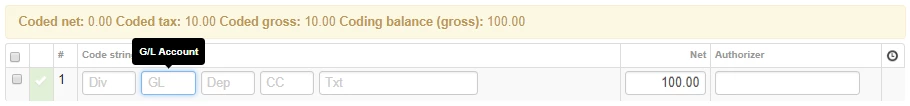
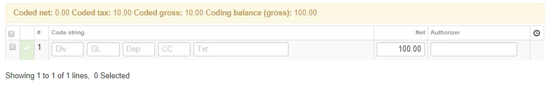
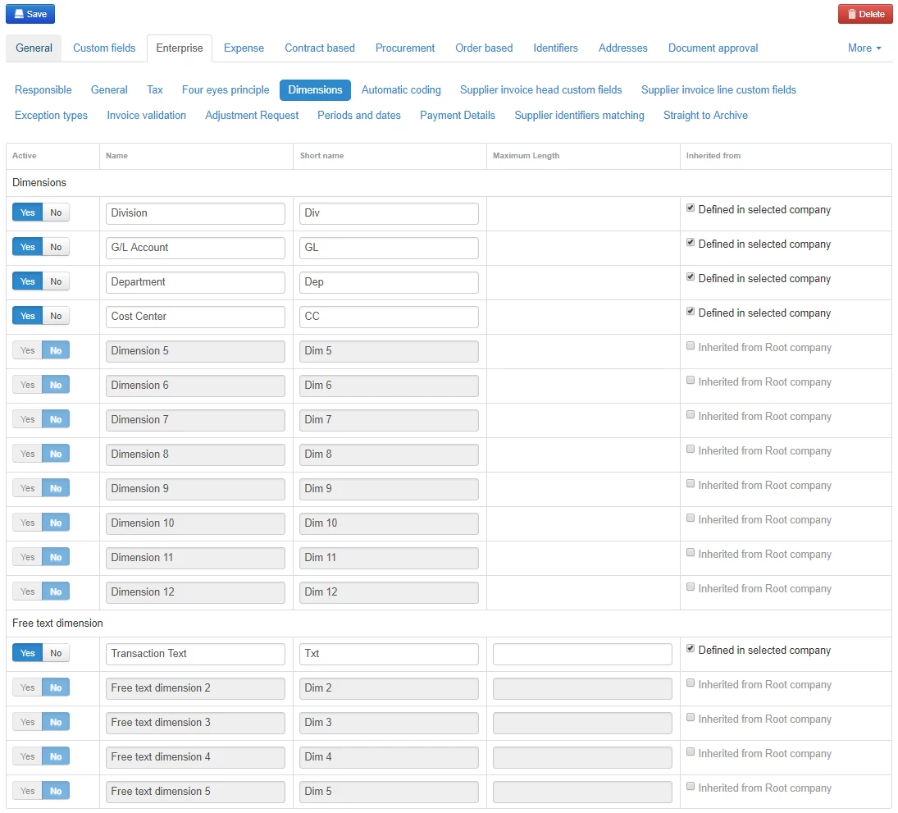
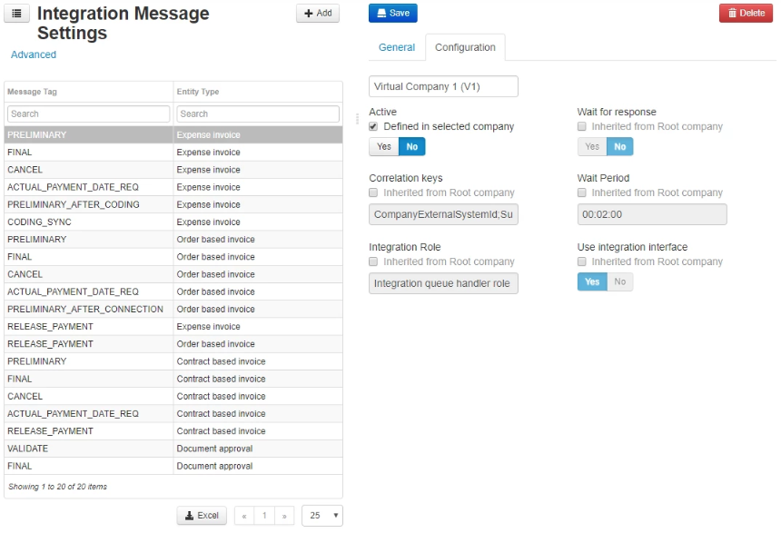
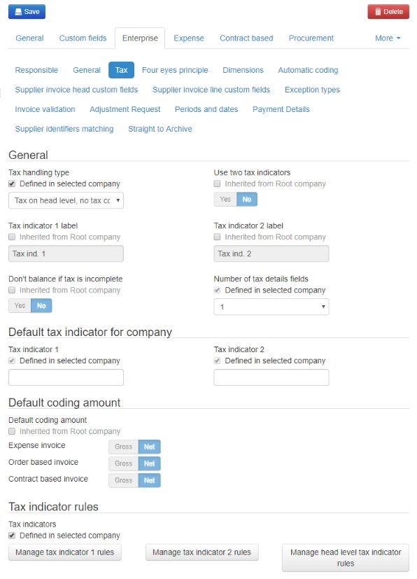

## Dimensions

The coding dimensions in Medius AP Automation should reflect the financial Dimensions set up in your ERP. Once it has been determined what dimensions to make use of in Medius, go to **Administration > Company > [Virtual Company for ERP] > Enterprise > Dimensions**.

If you are not using an ERP-specific integration package provided by Medius, you will usually activate and label dimensions in sequential order, without any gaps in the series. For example, you are likely to use Dimension 1-4. For an integration package provided by Medius, you will need to pay extra attention as there might be gaps in the series. For example, you might use Dimension 1-3, and Dimension 8-9.

1. Click the **Inherited from Root company** checkbox, changing it to **Defined in selected company** for all rows in the table.
2. Set the toggles in the **Active** column for the Dimensions you want to use to **Yes**.
3. Enter the appropriate label provided by the client in the **Name** column. This name will be displayed in the tooltips. These tooltips appear when one of the coding fields is active. In the image below, Name is set to *G/L Account*.

4. Enter a short version of the label in the **Short name** column. This name will be displayed in the coding field itself. In the image below the short names are *Div*, *GL*, *Dep*, *CC* and *Txt*.

5. If you are using free text dimensions, for example to let the client enter some kind of transaction text, you should also enter a **Maximum character length** for the string. This should be based on the limit for the corresponding field in the ERP system.
6. Click **Save**.

For more information, see the [Dimension value documentation on the Success Portal](https://success.mediusflow.com/documentation/administration_guide/administration_pages/dimension_value/#general).

## Default accounts

If you selected what integration to work with here, the next section will include information about what accounts to setup specific for the integration used.

## Integration message settings

If you do not want to use preliminary posting messages (this depends on whether you are using an integration package where this is a requirement) you should disable certain integration messages.

1. Go to **Administration > Integration Message Settings, [PRELIMINARY - Expense invoice] > Configuration**.
2. Click the empty field to bring up the different options and select the virtual company corresponding to the ERP with which you are working with.
3. Click the **Inherited from Root company** checkbox under **Active**. The label should change to **Defined in selected company**.
4. Set the toggle to **No**.
5. Click **Save**.

For more information, see the [Integration message settings page on the Success Portal](https://success.mediusflow.com/documentation/administration_guide/administration_pages/integration_message_settings/).

The next section will contain more information based on your integration.

## Tax settings

Medius allows for a range of Tax related settings. This is highly dependant on ERP and regional practises. The standard configuration in XI is to utilize tax indicator in line level, so these needs to be turned off.

1. Go to: **Administration > Company > [Virtual Company for ERP] > Enterprise > Tax**.
2. Find the **Tax handling type** label.
3. Click the **Inherited from Root company**  checkbox, changing it to **Defined in selected company**.
4. Select **Tax on head level, no tax codes** in the drop down.
5. Click **Save**.

For more information, see the [Tax section of the Enterprise page on the Success Portal](https://success.mediusflow.com/documentation/administration_guide/administration_pages/company/enterprise/#tax).

## Posting periods and posting dates

Configure the period settings to use according to the [Period page on the Success Portal](https://success.mediusflow.com/documentation/administration_guide/administration_pages/period/).

For information on best practices related to periods, see [Good practices in period handling on the Success Portal](https://success.mediusflow.com/documentation/administration_guide/administration_pages/configuration_tutorials/periods_good_practices/).

## Custom fields

In some cases you might need to use additional fields that are not handled by Medius by default. To configure them, follow the instructions on the [Enterprise page on the Success Portal](https://success.mediusflow.com/documentation/administration_guide/administration_pages/company/enterprise/#supplier-invoice-head-custom-fields).

## Maximum number of characters in invoice number

You need to adjust this setting if the ERP system has an upper limit of allowed characters in the invoice number. To do this, follow the instructions on the [Enterprise page on the Success Portal](https://success.mediusflow.com/documentation/administration_guide/administration_pages/company/enterprise/#invoice-validation).

## Deviation coding

The deviation coding automates allocation and reallocation of amounts in the corresponding accounting depending on whether the deviations are approved or not. For information on this configuration, see the [Enterprise page on the Success Portal](https://success.mediusflow.com/documentation/administration_guide/administration_pages/company/enterprise/#automatic-coding).

If you selected an integration, the accounts to provide will be listed in the next section.

## Decimal configuration
If the client has invoices and purchase orders with unit price showing more than 2 decimals (which is the default), the resolution can be increased to show more decimals on the unit price. This can reduce the number of manual connections to be done before the matching step. 
Add a record for Unit Price resolution for all the affected currencies. This configuration is done in [Resolution configuration](https://success.medius.com/documentation/administration_guide/administration_pages/resolution_configuration/) page in Medius . 

For Quantity, the resolution should be the same as in ERP.

Note that the resolution of Amount shall not be changed.