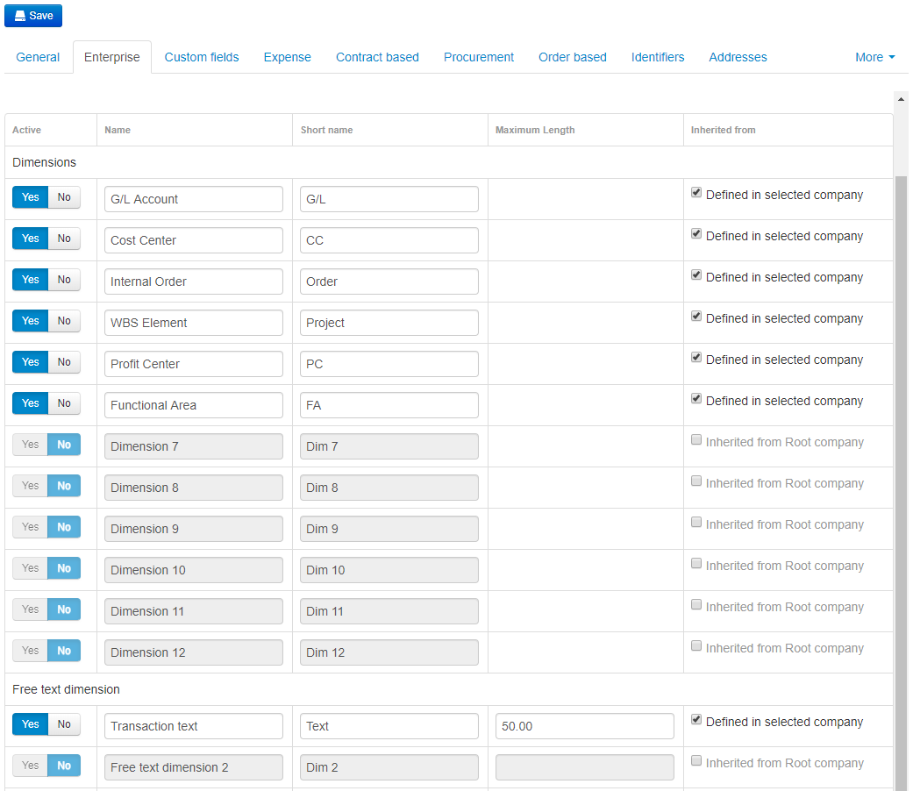
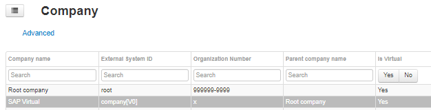
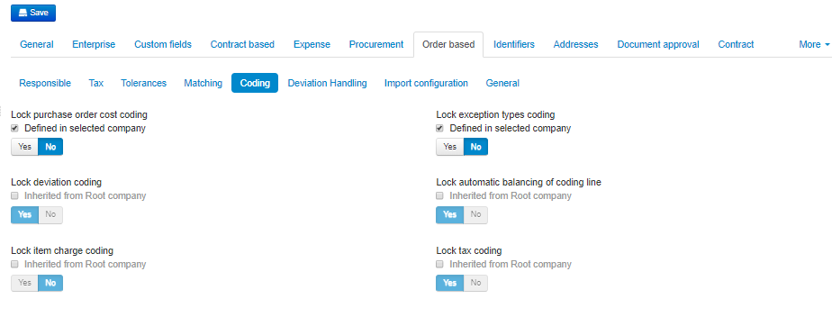
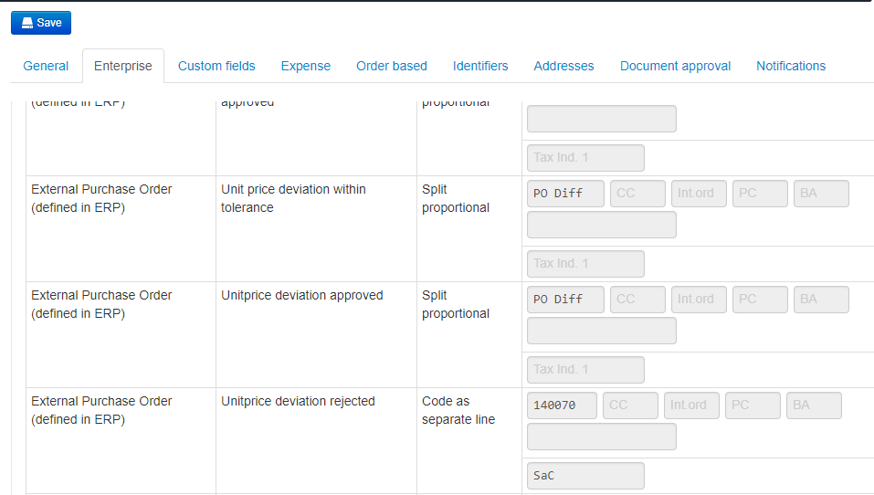
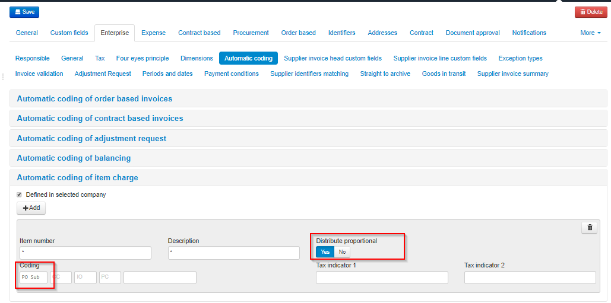
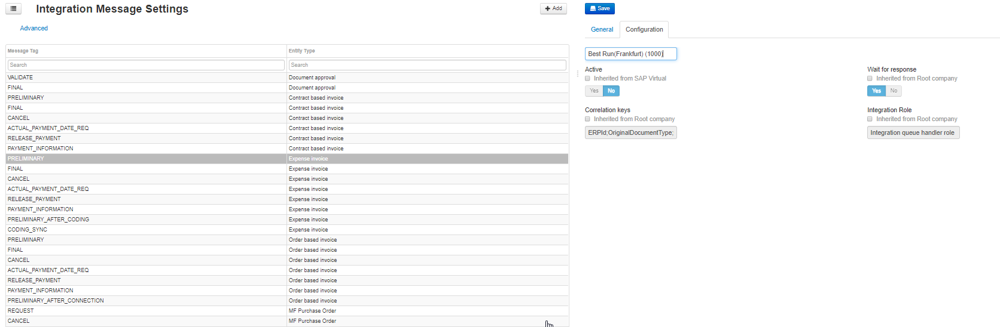
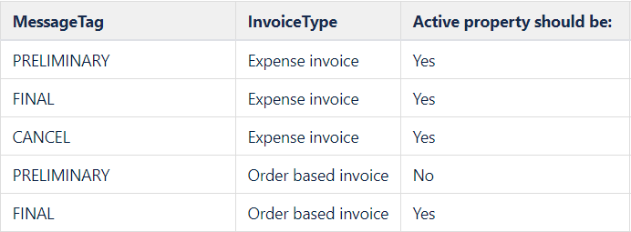

### Enable Dimensions
Administration→ Company→ Enterprise → Dimensions

Medius needs to be configured with what dimensions and dimension names that are relevant for your organization. 
Dimensions are configured in the [Company configuration](https://cloud.mediusflow.com/$TenantNameQA/#/Administration/Medius.Core.Entities.Company/). Then browse to the **Enterprise** tab and choose **Dimensions**.

The coding dimensions in Medius should reflect the G/L and account assignment structure that you are using in SAP. In Medius, the order of account assignments is determined by the number of the dimensions used. The Medius SAP connector have some fixed dimension numbers but most of them are flexible as shown in the list below.

Below you find a list of dimensions available in Medius for SAP, please determine which ones are relevant to you. More information about the use of these in Medius can be found here: [SAP Master data](https://success.mediusflow.com/documentation/cts-documentation/sap/SAP_solution/SAP_masterdata/)

- G/L Account (Dimension 1)
- Cost center (Dimension 2)
- Internal Order 
- WBS Element (project structure)
- Profit center 
- Functional area
- Fixed assets (Dimension 1)

Dimensions can be configured at virtual company level and/or in the real company codes. The dimensions that are shared between the companies in the virtual group is recommended to be configured at virtual level. 

Please consider that names of the dimensions are not impacted by user language settings. So, if you'd like to use different dimension names for different companies Dimension configuration should not be done at virtual level.

In addition to the above dimensions it is suggested to enable a free text dimension for the purpose of approvers to enter an descriptive text to the G/L entry that will also be posted to the G/L entry in SAP.

In a newly created tenant the dimension configuration looks like this:

1. Click the **Inherited from Root company** checkbox, changing it to **Defined in selected company** for all rows in the table.
2. Set the toggles in the **Active** column for the Dimensions you want to use to **Yes**.
3. Enter the appropriate dimension name for the dimensions that should be used in the *Name* column. This name will be displayed in the tooltips. These tooltips appear when one of the coding fields is active. 
4. Enter a short version of the label in the **Short name** column. This name will be displayed in the coding field itself.
5. Enable *Free text dimension 1* with appropriate name to allow for G/L text entry. Set the maximum length to **50** since this is maximum number of characters acccepted by SAP. 
6. Click **Save**.

Below you find the proposed SAP setup with all account assignments in use:

### Maximum length of free text dimension
Administration→ Company→ Enterprise → Dimensions

SAP has a limit of 50 characters for the field BSEG-SGTXT. When and if a free text dimension is needed add it as below.

Activate Free text dimension 1 as below.

### Invoice number length validation
Administration -> Company -> Virtual -> Enterprise -> Invoice validation

SAP have a limit in terms of how long the invoice number can be (maximum of 16 characters), we can activate a check for the length in XI.

## Settings in Medius for Orderbased Invoices

### Order based coding
Administration → Company → Orderbased → Coding

### Automatic coding order based invoices
Administration -> Company -> Virtual -> Enterprise -> Automatic coding -> Automatic coding order based invoices

Create it for header, line and unit price deviations, within tolerance and approved deviations.
(GL account for rejected deviations will vary between customers)

### Item Charge automatic coding order based invoices
1. Activate Item Charge Connection : Administration → Company → Order based → Matching

2. Configure the automatic coding of item charge : Administration → Company → Enterprise → Automatic Coding 

    * Input "*" in Item Number and "PO Sub" in Coding. 
    * Choose always "Yes" for "Distribute Proportional" then a invoice amount will be splited proportionally by the connected PO amounts when a invoice line is connected to multiple PO lines. 
    
    

### Integration message settings
Administration → Integration Message Settings

Activate or inactivate integration message settings, like preliminary postings.
Do this configuration on company V0:

Apply the changes as presented in the table below:

