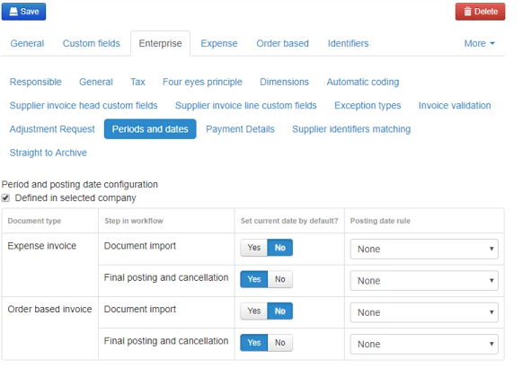

Best practise is to set the Posting Date to the date the invoice hits post control (as close as we can get to "the date the invoice is sent to the ERP" and still allowing a manual override when necessary).

Go to Administration --> Company --> [Virtual Company for ERP] --> Enterprise --> Periods and dates.

1. Click the "Inherited from Root company"  checkbox, changing it to "Defined in selected company"
2. Set the Yes/No toggles in the column "Set current date by default?" and "Final posting and cancellation" rows to: Yes
3. Click the Save button

The screen should now look like this:

