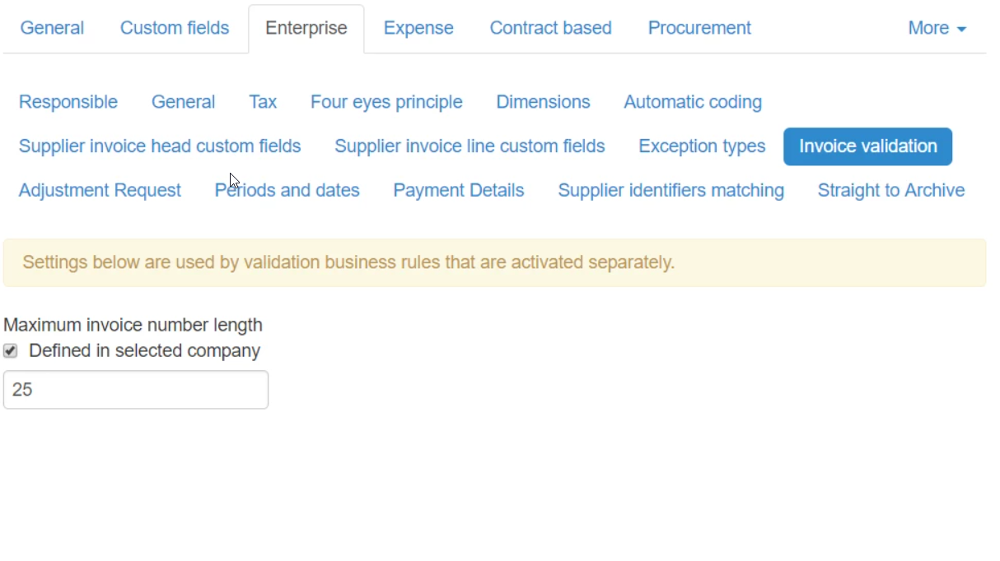

It is relatively common that there is a limitation in the ERP we are integrating with for how many characters that are allowed in the invoice number. By specifying a character limit for the Invoice Number, invoices exceeding this limit will be stopped at Document Import. We do not want to catch this when the invoice fails to post in the ERP, it is much better to catch it at Document Import so the issue can be addressed upfront. 

Go to Administration --> Company --> [Virtual Company for ERP] --> Enterprise --> Invoice validation

1. Click the "Inherited from Root company"  checkbox, changing it to "Defined in selected company"
2. Enter the number of allowed characters

