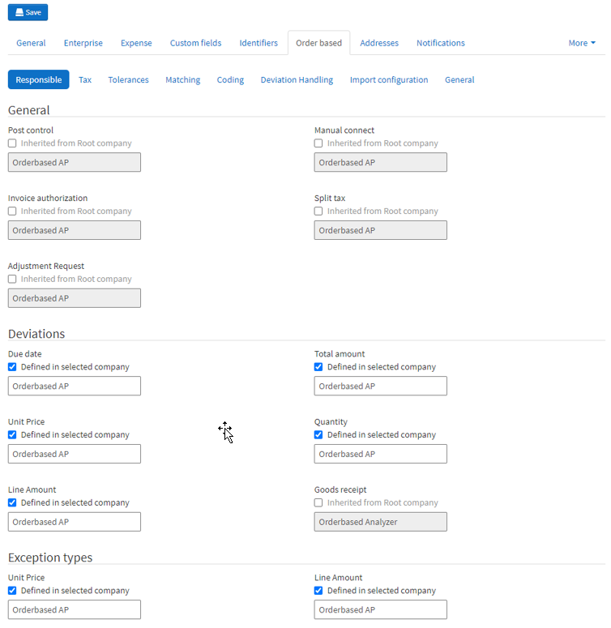

In Medius AP Automation you can assign users or roles to be responsible for different steps of the process. 
These settings determine what users, or group of users, are responsible to perform certain tasks e.g. 
"Who is responsible for routing a non-PO invoice that has not been automatically routed?"

The best practice is to assign roles instead of individual users. This will enable shared workload as well as easier if 
there are changes within your organization.

As with many other steps, these settings might vary from one client to another depending on their requirements, and most of the time we stick to the standard settings. Settings are found in a couple of places:
* Administration --> Company --> [Virtual Company for ERP] --> Enterprise --> Responsible
* Administration --> Company --> [Virtual Company for ERP] --> Expense --> Responsible
* Administration --> Company --> [Virtual Company for ERP] --> Order-based --> Responsible

The only settings we normally change for more or less all clients is the responsible user for Deviations and Exception Types *(note: applicable for match/PO invoices only!)*. The role/user specified here is normally a fall back for whom to route invoices to in the Analyze step in case of an out of tolerance deviation, used if none of the more specific routing options work out. Most clients prefer this fall back to be the AP staff, unless they have a very small group of users responsible for the Analyze step.

*Go to Administration --> Company --> [Virtual Company for ERP] --> Order-based --> Responsible*

1.	Click all the "Inherited from Root company" check boxes in the "Deviations" and "Additional charge" sections, changing them to "Defined in selected company"
2.	Change all of the fields from "Orderbased Analyzer" to "Orderbased AP" in these sections
3.	Click the **Save**  button

*You should now have a screen that look something like this:*

