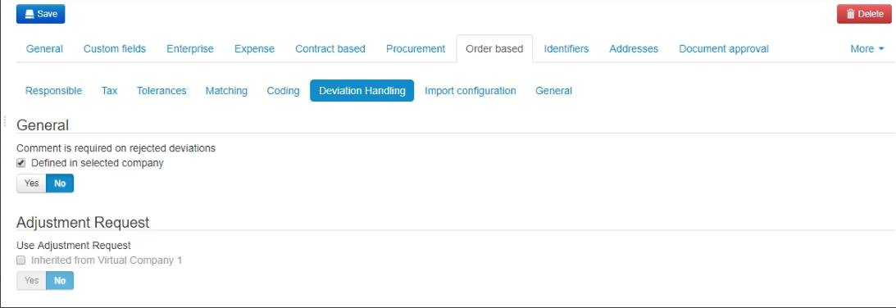

This section covers general settings that need to be configured based upon your organization's structure and processes. 
We recommend that this is done in cooperation with your implementation partner who can guide you through this process.

## Responsible roles for different workflow steps

In Medius AP Automation you can assign users or roles to be responsible for different steps of the process. 
These settings determine what users, or group of users, are responsible to perform certain tasks e.g. 
"Who is responsible for distributing an expense invoice that has not been automatically distributed?"

The best practice is to assign roles instead of individual users. This will enable shared workload as well as easier if 
there are changes within your organization.

Verify standard setup here: [Enterprise responsible settings](https://cloud.mediusflow.com/$TenantNameQA/#/Administration/Medius.Core.Entities.Company).

1. Choose what Company to apply settings to. It is recommended to apply settings at virtual level for minimal administration.
2. Go to tab "Enterprise".
3. Go to sub-tab "Responsible".

Read more about these settings: [Enterprise responsible documentation](https://success.mediusflow.com/documentation/administration_guide/administration_pages/company/enterprise/#responsible).

## Ensure comment on rejected deviations

Consider having a requirement for users to add a comment if they reject a deviation. To activate this feature:

1. Go to **Administration > Company > [Virtual Company for ERP] > Order based --> Deviation Handling**.
2. Check the **Inherited from Root company** checkbox in the **Comment is required on rejected deviations** section. The label should change to **Defined in selected company**.
3. Set the toggle to **Yes**.
4. Click **Save**.

For more information, see the [Validator Configuration page on the Success Portal](https://success.mediusflow.com/documentation/administration_guide/administration_pages/validator_configuration/#forcecommentonrejecteddeviation).
