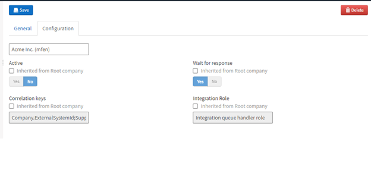

In the design phase the question of whether to use preliminary posting or not should have been answered. If it is not being used, we need to disable certain integration messages.

Go to Administration --> Integration Message Settings, [PRELIMINARY - Non-PO invoice] --> Configuration, click in the empty field to bring up the different options and select the virtual company corresponding to the ERP with which you are working with.

1.	Click the checkbox under the Active header labelled "Inherited from Root company". The label should change to "Defined in selected company".
2.	Set the toggle to: No
3.	Click the **Save** button

You should have a screen that looks something like this:

Repeat the steps above for the following entries:

1.	CANCEL - Non-PO Invoice
2.	PRELIMINARY - PO Invoice
3.	CANCEL - PO Invoice

If you are using additional invoice types, you will want to do this for those as well.
