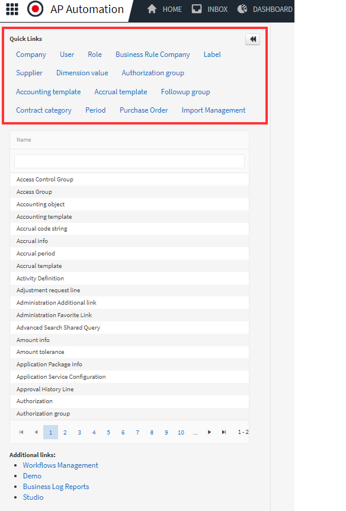

Quick links are easily accessible administration options found at the very top of the Administration screen.

First we want to look over the list of links available to be used as a favorite and decide which are useful for your organization.

For instance, in North America no client is using or has used Accrual templates so we usually disable the default favorite link for that page. Any of these links can still be accessed in the main list below the favorites.

Go to Administration --> Administration Favorite Link --> [Accrual template] 

1.	Set the Active toggle to: No
2.	Click the **Save** button

Also, if your organization is using the Match module, we want to activate the link to the Purchase Orders, as we often want to access this screen when creating test invoices for the order-based workflow. Some clients also find it very useful to examine the imported data from that screen. 
 
Go to Administration --> Administration Favorite Link --> [Purchase Order] 

1.	Set the Active toggle to: Yes
2.	Click the **Save** button

Continue to adjust these as is best for your organization.
