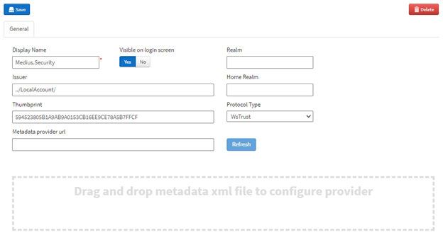
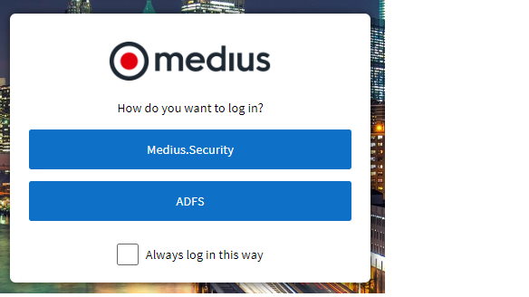

If your organization uses external authentication (ADFS, OneLogin, etc.) it doesn't make sense to present the users with a choice for what authentication method to use when they access Medius; they should always use the external authentication and giving them a choice will only cause confusion and frustration on the end user's part.

That is, we do not want the users to be greeted by a screen that looks like this:

 
To turn off the option for "Medius authentication", follow the steps below.

Go to Administration --> Login Option.

1.	Select Medius.Security
2.	Set the "Visible on login screen" toggle to: No
3.	Click the **Save**  button

You should have a screen that looks something like this:
 

 
To log in with a local Medius account you will need to use a URL that looks like this, https://cloud.Medius.com/[tenant name]/LocalAccount/, moving forward.