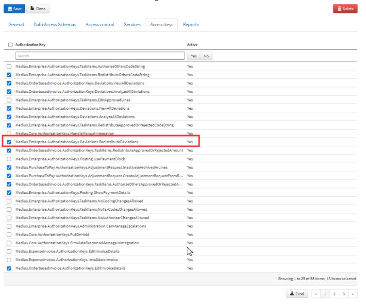

We normally want to allow members of the Orderbased Analyzer and Orderbased AP roles to reroute deviations to other users. 

More information about the Roles and how they can be modified can be found [here]:(https://success.Medius.com/documentation/administration_guide/administration_pages/role/)

It is important to remember that it is safe to add access keys to a role, it will not risk being removed in an upgrade, but that if you want to remove access keys you are better off creating a new Role altogether.

See below regarding the rerouting of deviations.

Go to Administration --> Role --> [Orderbased AP]  --> Access Keys

1.	Check the checkbox next to Medius.Enterprise.AuthorizationKeys.Deviations.RedistributeDeviations
2.	Then click the **Save** button.

Repeat for Administration --> Role --> [Orderbased Analyzer]  --> Access Keys

You should have a screen that looks something like this:

