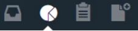
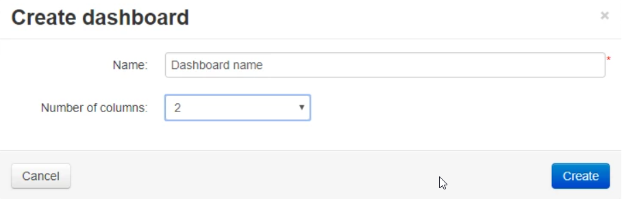
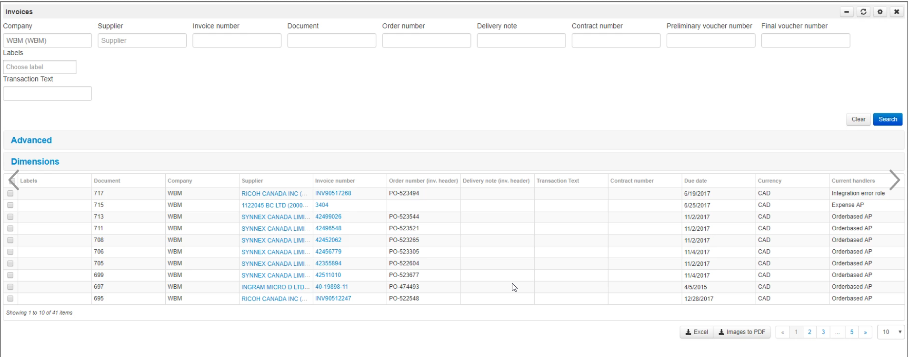
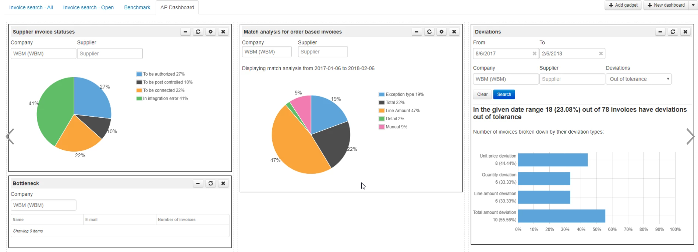
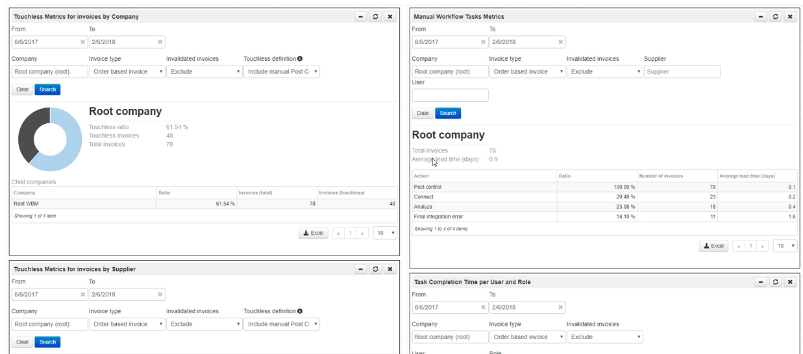

# **Note**

>When creating Dashboards, the account you are logged on with will be the owner of those dashboards. This means that other users, even if they have access to them, will not be able to make any changes to them. They will not be able to add or remove gadgets, nor to change the settings of an existing gadget. This is a good thing, as it prevents someone from making changes without realizing that they are affecting everyone else.

>It is important to create the Dashboard in the appropriate order. In what order the dashboards are created will determine in what order the tabs ar lined up, and it can be very frustrating to have the most commonly used Dashboard being the second tab as the application always will return to the first tab. The order of the tab cannot be changed without deleting the dashboards and re-creating them in the correct order. You want to get this right from the start.

# **How to create a dashboard**

1. Click on the Dashboard icon 

2. Select New dashboard
3. Enter a name for your Dashboard and select number of columns. Then click Create.

4. Click Add gadget
5. Select the gadget to add. Here you can read about [all available gadgets](https://success.mediusflow.com/documentation/administration_guide/administration_pages/gadget/)

# **Best practise**

Four dashboards are normally created: 
1. Invoice Search - Open Invoices
2. Invoice Search - Archived Invoices
3. AP Dashboard 
4. Benchmark

## 1. Invoice Search - Open Invoices

1. Create a new Dashboard with one column and add this gadget: 
   - Invoices
2. Click on Settings 
3. Set the filter to Open

## 2. Invoice Search - Archived Invoices

Same as "Invoice Search - Open Invoices" except that the filter should be set to Archived.

## 3. AP Dashboard

Create a new Dashboard with three columns and add these gadgets:
- Supplier invoice statuses
- Bottleneck
- Match analysis for PO invoices
- Deviations

## Grant dashboards to relevant roles

Assign the relevant roles to default dashboards as follows:

1.	AP Dashboard
   * Expense AP
   * Orderbased AP
2.	Invoice Search - All Invoices 
   * Core Standard Application Role
3.	Invoice Search - Open invoices 
   * Core Standard Application Role

Perform following steps for above dasborads and roles:

1. Go to Administration > Dashboard
2. Select dashboard and go to the Role tab
3. Select role and then click Add role
4. Click Save

Repeat steps for all dasboards and roles. 

## 4. Benchmark

>The Benchmark Dashboard contains information that not all users should have access to. Decide which users/roles that should have access. As a standard we grant permission to the Auditor role.

By default the gadgets Manual Workflow Task Metrics and Task Completion Time Per User and Role are restricted and you will need to activate them.

To access these settings go to Administration > Gadget
1. Select the gadget and go to the Access tab.
2. In Role list type in Auditor and then click Add role 
3. Click Save

Create a new Dashboard with two columns and add these gadgets:
- Touchless Metrics for invoices by Company
- Touchless Metrics for invoices by Supplier
- Manual Workflow Task Metrics
- Task Completion Time Per User and Role

To restrict this Dashboard to the Auditor role go to Administration > Dashboard
1. Select Benchmark and go to the Role tab
2. Type auditor and select Auditor role. Then click Add role
3. Click Save

