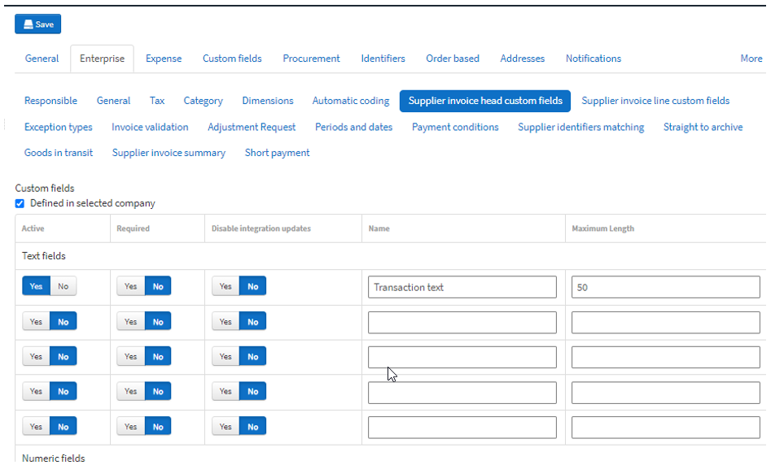
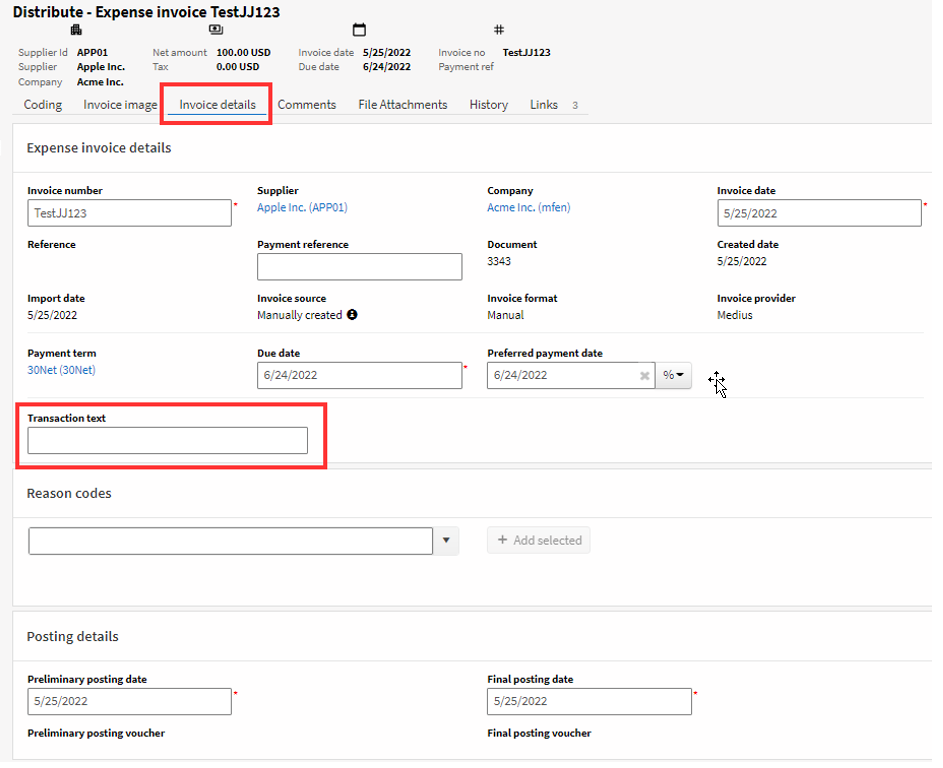

A common custom field example would be to enable a text field labeled "Transaction Text" that a user can type into that will map somewhere in the ERP once the invoice is posted. The following types of custom fields can be added:

    * Text
    * Numeric
    * Date
    * Boolean (Yes/No toggles)
    * List

For Text fields it is possible to specify a maximum string length.

To add a custom field, go to Administration --> Company --> [Virtual Company for ERP] --> Enterprise --> Supplier invoice head custom fields

1. Click the "Inherited from Root company” checkbox up at top, changing it to "Defined in selected company"
2. Set the Yes/No toggle in the Active column to: Yes, for the field you want to activate.
3. Enter the label you want displayed in the GUI in the Name column
4. If it is a text field, enter the number of allowed characters in the Maximum Lenth column (should correspond to any limitation in the ERP)
5. Then click the **Save** button

Once you've added a few fields you should have a screen that looks something like this:

These fields will now be visible in the Invoice Details screen for all types of invoices:

