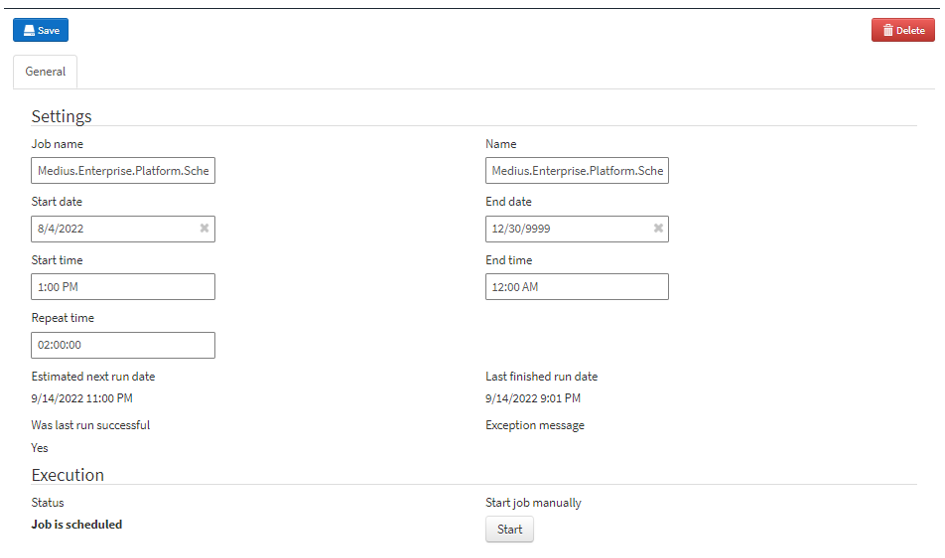

There are primarily three jobs to adjust at this stage, but you will need to revisit this page around go live to set the email related jobs. The jobs to look at now are:

1.	DelegatedTaskAssignment
    * This job goes through the Temporary Delegation settings for all users and make sure that invoices that qualify for delegation show up in the inbox of the delegatee.
2.	AutoConnectScheduledJob (Match only)
    * This job goes through invoices in the Connect step and run through the connection logic. So, if an order is imported after the invoice was imported, it can still be automatically connected.
3.	AutoReconnectWithDeliveryLinesJob (Match only)
    * This job goes through invoices in the Connect and Analyze step that already have been connected to PO lines and add connections to Goods Receipts if they were missing when the invoice was imported.

Go to Administration --> Scheduled Job Configuration

1.	Filter the list of scheduled jobs for the job you are looking for by typing in the field at the top of the Name column
2.	Make sure that the End date field for the selected job is set to a date far in the future
    * The job will be considered "scheduled" between the specified Start date and End date
3.	Set the Repeat time for the listed jobs, below are suggested values (format: dd:hh:mm:ss, but the dd: part can be omitted)
    * DelegatedTaskAssignment: 2:00:00
    * AutoConnectPurchaseOrderJob : 0:05:00
    * AutoReconnectWithDeliveryLinesJob: 2:00:00
4.	Then click the **Save** button, and repeat for the other two jobs.

For the DelegatedTaskAssignment it should look something like this:

