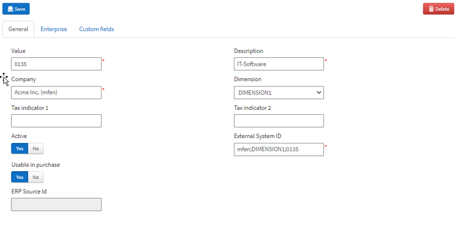

Sometimes there are a couple of fields on forms AP use to enter invoices that specifically call out Freight, Misc. Charges, Taxes, etc., with certain logic associated with them. It might then make sense to simply classify cost in Medius in the same manner and let the ERP execute the same logic when the invoice is posted. If the functional specification calls for dummy accounts, this is how you add them. 
 
These are pretty much always added for Dimension 1, even though that might not be the Account dimension.

Go to Administration --> Dimension value

1. Click the **Add** button
2. Set the Value field to the value that should show up in the coding screen
    * Avoid using spaces, it can confuse the filtering in the coding fields
3. Set the Description field to 'Dummy Account'
4. Set the Company field to the virtual company representing the ERP system
5. Set Dimension to DIMENSION1
6. Set the ExternalSystemID to: [Company id];DIMENSION1;[the value you picked]
    * For example: V1;DIMENSION1;MyDummyValue
    * What you use for the External System ID isn't important, as long as it is unique and doesn't match anything from the ERP; this format is just used to be consistent with the imported data
7. Then click the **Save** button
8. Repeat for each value you are adding

When you are done, you should have a screen that look something like this:

