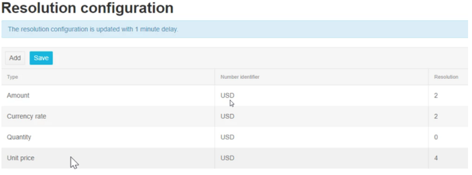

It is important to set the resolution (the number of decimals) that should be used for Unit Prices and Quantities to avoid rounding issues. The resolution in AP Automation should be set to the same resolution used in the system we retrieve PO data from. 

The Unit Price resolution is specified by currency (this is useful as there are some currencies, e.g. Japanese Yen, that does not ever have any decimals) and the Quantity resolution is specified by Unit. This should be done prior to importing any order data. Order data imported after any of these resolutions has been updated will have to be re-imported to update with the correct number of decimals. The standard resolution that will be applied if nothing is specified is 2.

First, set the Unit Price resolution. 

Go to Administration --> Resolution Configuration

1. Click the Add button.
2. Set the "Number Identifier" field to 'USD' (or 'CAD' as applicable).
3. Set the "Resolution" field to number of decimals. This has to be an integer.
4. Click the Save button.

Second, set the Quantity resolution. In many integrations, units besides the standard '-' that the environment comes with are not imported or set up. This can save a lot of time if there are many units and it is needed to specify what resolution to use. 

Go to Administration --> Quantity Configuration

1. Click the Add button.
2. Set the "Number Identifier" field to '-'.
3. Set the "Resolution" field to number of decimals. This has to be an integer.
4. Click the Save button.

Repeat for all currencies having orders placed in it. When you are done, you should have a screen that look something like this:

