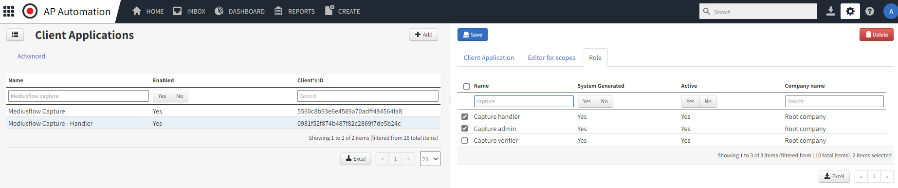

> # NOTE: this step is no longer required! Client applications will be activated automatically when Capture is deployed and activated.
> ## Instead continue to next step for activating Capture in Production. 

Make sure the Capture application is enabled:

1. Go to Admin Pages > Client Application.
2. Verify that 'Mediusflow Capture' is enabled.
3. Verify that 'Mediusflow Capture - Handler' is enabled and that checkboxes for roles 'Capture handler' and 'Capture admin' are ticked.

