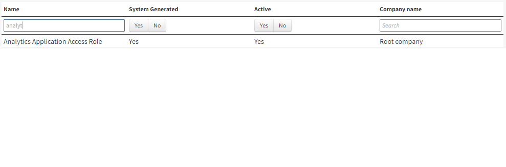

A user needs the *Analytics Application AccessCustomers* role to be able to access Analytics. 

Make sure number of users with access role does not exceed users paid for. 

How to add a role to a user is described [here](https://success.medius.com/documentation/administration_guide/administration_pages/user/role/#gatsby-focus-wrapper).
